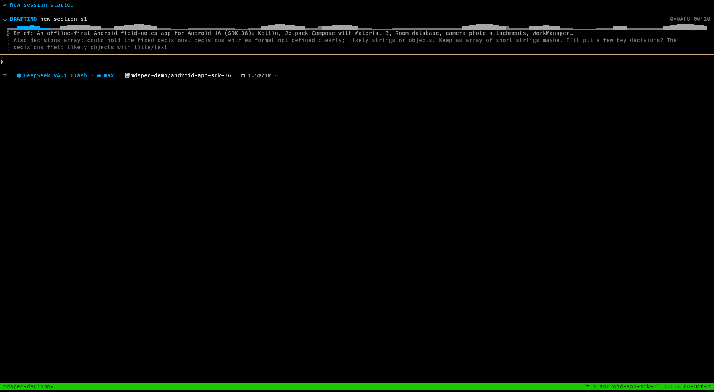

# omp-plugins

Plugins for the Oh My Pi coding agent (`omp`). Each plugin lives in its own directory under `plugins/` and loads as an `omp` extension module.

## Plugins

### master-document-spec

Author, review and finish a technical specification from an interactive session. The plugin keeps one LaTeX source of truth, compiles it in a sandbox, mirrors it to Markdown, and requires one explicit approval per section.

- Slash command: `/mdspec` (alias `/master-document-spec`)
- Tool: `master_document_spec_status` (read-only status for the model)
- Output: `spec.tex`, `spec.md` and `spec.pdf` in the destination directory you choose



The animation shows a session authoring an Android 16 (SDK 36) app specification: the live drafting activity, the per-section review dialog, approval with checkpoint, the document preview, and the final status.

External tools on `PATH`: `latexmk` and XeLaTeX from TeX Live, `mutool` from MuPDF, `pdfinfo` from poppler, `bwrap` from bubblewrap, and `flock` from util-linux.

Distro install examples:

```sh
# Gentoo
emerge dev-tex/latexmk app-text/texlive dev-texlive/texlive-xetex \
  dev-texlive/texlive-latexextra dev-texlive/texlive-langfrench \
  app-text/mupdf app-text/poppler sys-apps/bubblewrap sys-apps/util-linux

# Debian
apt install latexmk texlive-xetex texlive-latex-extra texlive-lang-french \
  mupdf-tools poppler-utils bubblewrap util-linux
```

## Requirements

- Oh My Pi 18.x (`omp`).
- Bun. Oh My Pi loads extension modules with Bun, and the plugins install their dependencies with `bun install`.

## Install on Oh My Pi

1. Install the plugin dependencies:

```sh
cd plugins/master-document-spec
bun install                # development install (tests and type check)
# or
bun install --production   # runtime dependency only
```

Oh My Pi loads the extension module but not its `node_modules`; the plugin fails to load with `Cannot find package 'zod'` until you install the dependencies.

2. Load the plugin. Choose one method.

Auto-discovery (recommended). Link or copy the plugin directory into the agent extensions directory:

```sh
mkdir -p ~/.omp/agent/extensions
ln -s /path/to/omp-plugins/plugins/master-document-spec ~/.omp/agent/extensions/master-document-spec
```

Oh My Pi loads every `.ts`/`.js` file and every one-level subdirectory with `index.ts` under `~/.omp/agent/extensions/`. For one project only, place the link under `<project>/.omp/extensions/master-document-spec` instead.

Settings entry. Add the plugin path to a config file: the user config `~/.omp/agent/config.yml`, or a project config `<project>/.omp/config.yml`.

```yaml
extensions:
  - /path/to/omp-plugins/plugins/master-document-spec
```

Single run. Load the plugin for one session without a config change:

```sh
omp -e /path/to/omp-plugins/plugins/master-document-spec
```

3. Restart Oh My Pi. Extension modules load at session start, so a new or restarted session picks up the plugin.

4. Verify. Run `/mdspec help` in a session. If the plugin fails to load, `omp` prints `Failed to load extension <path>: <reason>` and writes details to `~/.omp/logs/`.

## Use

Start the guided flow in an interactive session:

```
/mdspec
```

The flow compiles the scaffold, asks you to approve the outline, then drafts, previews, revises and approves one section at a time. The final review compiles the document and finishes it. The command needs the interactive TUI.

Command actions:

| Action | Effect |
| --- | --- |
| `/mdspec` | Start a new specification, or resume the active one |
| `/mdspec resume <directory>` | Resume the specification in a destination directory |
| `/mdspec status` | Print phase, files, sections, approval state and page numbers |
| `/mdspec outline` | Same report as `status` |
| `/mdspec preview [all\|sN]` | Render the Markdown mirror in the conversation |
| `/mdspec revise` | Request a change to one section |
| `/mdspec goto [sN]` | Open one section for review |
| `/mdspec finish` | Run the document-wide review and finish |
| `/mdspec configure` | Edit document settings as JSON (title, author, language, paper, format, version, date) |
| `/mdspec reconcile` | Import external edits to section bodies |
| `/mdspec recover` | Restore an approved checkpoint |
| `/mdspec help` | Show the action list |

Ctrl+C cancels an operation. Escape saves and exits a dialog.

The model can call `master_document_spec_status` to read the outline, approvals, requirements, decisions and glossary. The tool cannot approve or change the document.

## Install on Pi

Oh My Pi is a fork of Pi. Oh My Pi loads Pi extensions through a compatibility layer, but the reverse is not true: a plugin that imports `@oh-my-pi/*` packages does not load on Pi.

Pi extension locations, for reference:

- `~/.pi/agent/extensions/*.ts` and `~/.pi/agent/extensions/*/index.ts` (global)
- `.pi/extensions/*.ts` and `.pi/extensions/*/index.ts` (project)
- Paths listed under `extensions` in `~/.pi/agent/settings.json` or `.pi/settings.json`
- `pi install npm:<pkg>`, `pi install git:<host>/<repo>`, or `pi install /path/to/package` for packages that declare a `pi` manifest in `package.json`
- `pi -e ./extension.ts` for a quick test

Install the plugin dependencies with `npm install --omit=dev` in the plugin directory, then place or link the directory in one of the extension locations above. Pi hot-reloads extensions in its auto-discovered locations with `/reload`.

master-document-spec does not load on Pi unchanged (checked against Pi 0.84.2). It uses four Oh My Pi-only surfaces:

1. Import scopes `@oh-my-pi/pi-coding-agent`, `@oh-my-pi/pi-tui` and `@oh-my-pi/pi-ai` in `index.ts` and `src/*.ts`. Pi provides the `@earendil-works/*` scope instead.
2. `pi.typebox.Type` in `src/commands.ts`. Pi exposes TypeBox only as the importable `typebox` module.
3. `getMarkdownTheme()` from pi-tui in `src/preview.ts`. Pi's pi-tui does not export it.
4. `streamSimple` from the pi-ai package root and `ctx.modelRegistry.resolver(...)` in `src/author.ts`. Pi exports `streamSimple` from `@earendil-works/pi-ai/compat` only, and its `ModelRegistry` has no `resolver` method.

To port the plugin for Pi, rewrite the import scopes to `@earendil-works/*` (Oh My Pi remaps that scope back to its own host modules, so the result still works on Oh My Pi), import `Type` from `typebox`, supply a pi-tui `MarkdownTheme` in the preview renderer, and replace the authoring stream and credential lookup with Pi's `@earendil-works/pi-ai/compat` streaming and `ctx.modelRegistry.getApiKeyAndHeaders(model)`.

## Development

```sh
cd plugins/master-document-spec
bun install
bun run check   # tsc --noEmit
bun test        # bun test
```

The tests exercise the real LaTeX compiler, so the external tools above must be installed.
